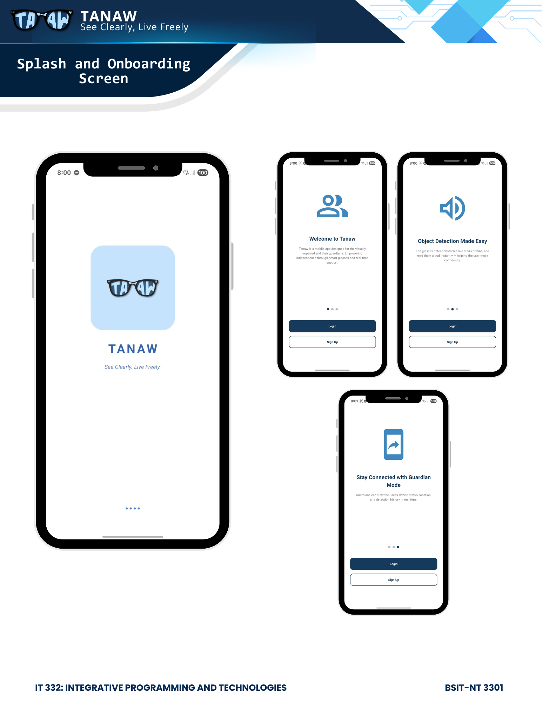
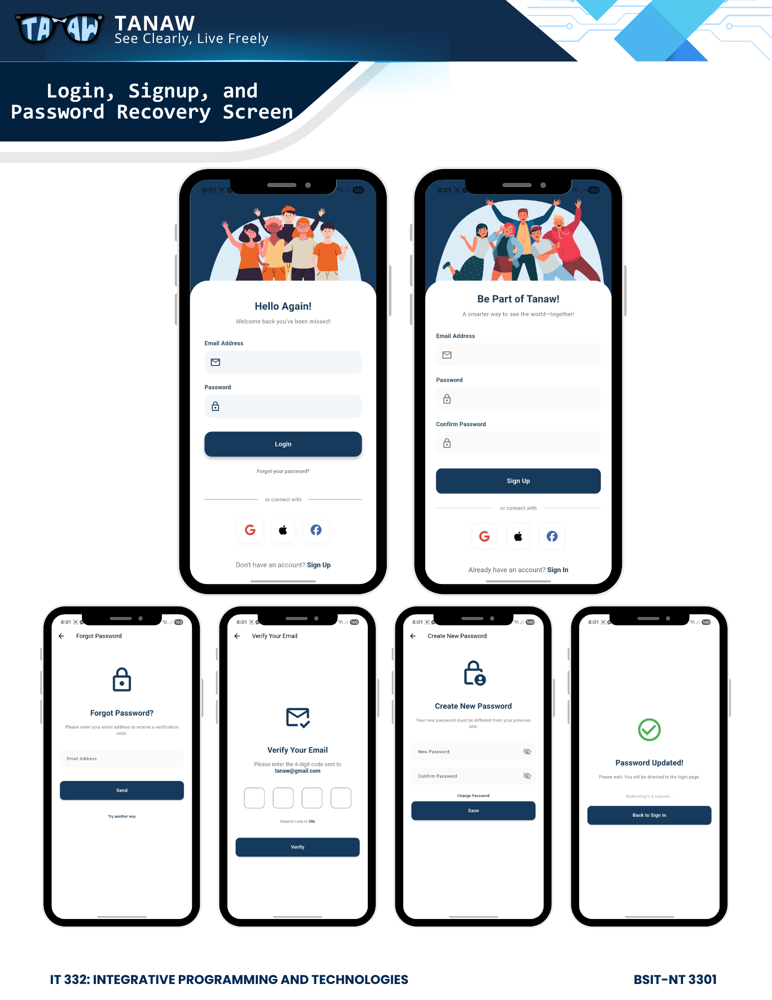
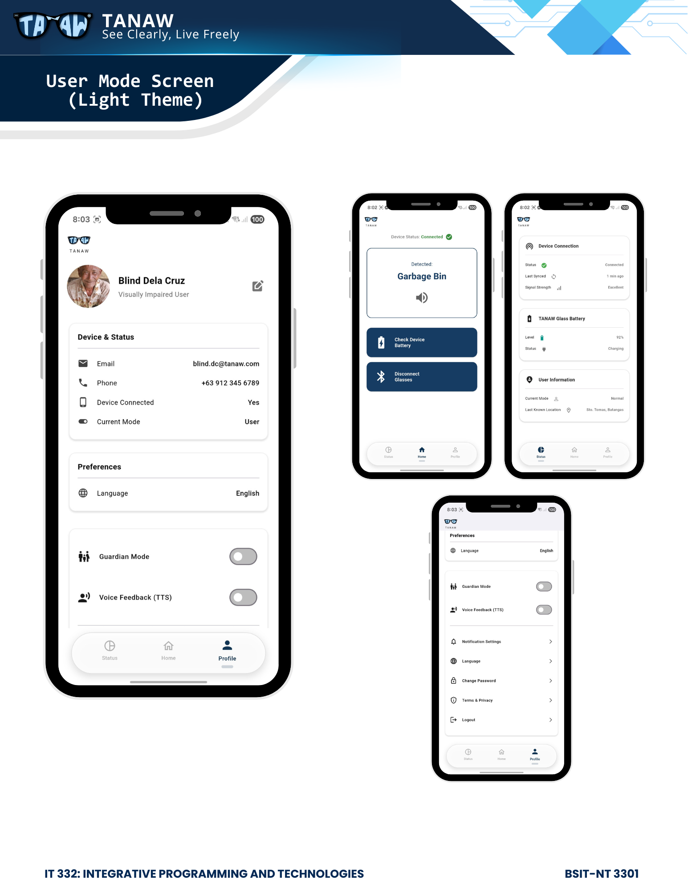
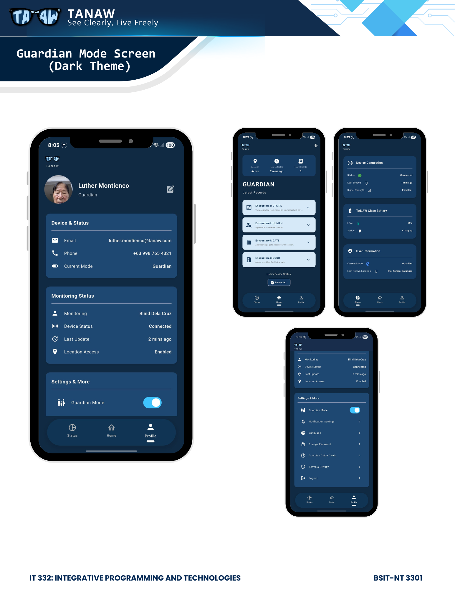

# TANAW Mobile Application

This document provides a detailed overview of the TANAW mobile application. It covers the project's purpose, setup instructions, architecture, and navigation structure, serving as a central source of information for developers and contributors.

## Table of Contents

- [About The Project](#about-the-project)
- [Getting Started](#getting-started)
  - [Prerequisites](#prerequisites)
  - [Installation and Setup](#installation-and-setup)
- [Project Architecture](#project-architecture)
  - [Directory Structure](#directory-structure)
- [Application Navigation Flow](#application-navigation-flow)
  - [1. Onboarding and Authentication](#1-onboarding-and-authentication)
  - [2. Main Application (User)](#2-main-application-user)
  - [3. Guardian Flow](#3-guardian-flow)
- [Key Features](#key-features)
- [Technology Stack](#technology-stack)
- [Design Principles](#design-principles)
- [UI Preview](#ui-preview)
- [Known Limitations](#known-limitations)
- [Developed By](#developed-by)

## About The Project

TANAW is a mobile application developed using Flutter, designed to assist visually impaired individuals by providing real-time obstacle detection and navigation guidance. It functions as a user-friendly interface for smart glasses, enhancing safety and independence for its users. The application is built with a focus on accessibility, scalability, and maintainability.

## Getting Started

Follow these instructions to set up the project on your local development machine.

### Prerequisites

Ensure you have the following software installed:

- **Flutter SDK**: Version 3.0.0 or higher. [Installation Guide](https://flutter.dev/docs/get-started/install)
- **Dart SDK**: Version 2.17.0 or higher. [Installation Guide](https://dart.dev/get-dart)
- **Code Editor**: A suitable editor like [Visual Studio Code](https://code.visualstudio.com/) (with the Flutter extension) or [Android Studio](https://developer.android.com/studio).

### Installation and Setup

1.  **Clone the Repository**:
    ```sh
    git clone https://github.com/your_username/tanaw_app.git
    ```

2.  **Navigate to Project Directory**:
    ```sh
    cd tanaw_app
    ```

3.  **Install Dependencies**:
    Run the following command to fetch all the required packages specified in `pubspec.yaml`:
    ```sh
    flutter pub get
    ```

4.  **Run the Application**:
    Connect a device or start an emulator, then run the app:
    ```sh
    flutter run
    ```
    The application should build and launch on your selected device.

## Project Architecture

The application follows a clean, feature-driven architecture that separates concerns, making the codebase modular and easy to manage.

### Directory Structure

The core source code is located within the `lib` directory, organized as follows:

```
lib/
├── data/         # Handles data sources. Contains API clients, database helpers, and repository implementations.
├── l10n/         # Contains localization and internationalization files for multi-language support.
├── main.dart     # The primary entry point of the Flutter application.
├── models/       # Defines the data structures and models used throughout the application (e.g., User, Report).
├── screens/      # Contains all the individual UI screens or pages of the application.
├── services/     # Implements business logic, such as authentication, navigation, and notification services.
├── state/        # Manages the application's state (e.g., using Provider, BLoC, or another state management solution).
└── widgets/      # Stores reusable UI components (e.g., custom buttons, input fields, cards) shared across multiple screens.
```

## Application Navigation Flow

The application's navigation is organized into several key user flows.

### 1. Onboarding and Authentication
This flow guides the user from their first interaction with the app to being fully authenticated.

-   **`splash_screen.dart`**: The initial loading screen.
-   **`onboarding_screen.dart`**: A tutorial for first-time users.
-   **`welcome_screen.dart`**: Presents the choice to either log in or sign up.
-   **`login_screen.dart`**: Handles authentication for existing users.
-   **`signup_screen.dart`**: Manages the registration process for new users.
-   **Password Reset Sub-flow**:
    -   **`forgot_password_screen.dart`**: Starts the password recovery process.
    -   **`verification_code_screen.dart`**: Verifies the user's identity.
    -   **`new_password_screen.dart`**: Allows setting a new password.
    -   **`password_changed_screen.dart`**: Confirms the password update.

### 2. Main Application (User)
This is the core experience for the visually impaired user after logging in.

-   **`home_screen.dart`**: The central dashboard, providing access to all primary features.
-   **`status_screen.dart`**: Shows the connection status of paired smart glasses and other devices.
-   **Profile and Settings Sub-flow**:
    -   **`profile_screen.dart`**: Displays user information and provides entry points to various settings.
    -   **`edit_profile_screen.dart`**: Allows modification of user details.
    -   **`security_screen.dart`**: Hub for security-related settings.
    -   **`change_password_screen.dart`**: In-app password change functionality.
    -   **`two_factor_auth_screen.dart`**: Manages 2FA settings.
    -   **`manage_sessions_screen.dart`**: View and manage active login sessions.
    -   **`notification_settings_screen.dart`**: Configure notification preferences.
    -   **`language_settings_screen.dart`**: Change the application's language.
    -   **`terms_privacy_screen.dart`**: Displays legal and privacy information.

### 3. Guardian Flow
This flow is designed for guardians to monitor and assist the user.

-   **`guardian_home_screen.dart`**: The main dashboard for the guardian, showing user status.
-   **`guardian_guide_screen.dart`**: Provides instructions for guardians.
-   **`reports_screen.dart`**: Displays user activity and navigation reports.

## Key Features

- **Multi-page Navigation:** Intuitive navigation for both user and guardian modes.
- **User and Guardian Modes:** Tailored experiences for primary users and their guardians.
- **Voice Feedback (TTS):** Integrated text-to-speech for audible feedback.
- **Device Connection Status:** Real-time status of the smart glasses connection.
- **Real-time Obstacle Detection:** A UI placeholder for obstacle alerts from the hardware.
- **Profile Management:** Easy-to-use profile and settings management.
- **Accessibility Support:** Fully compatible with TalkBack and designed with large, high-contrast UI elements.

## Technology Stack

- **Framework:** Flutter
- **Language:** Dart

*Note: Currently, the application is frontend-only. Backend services and hardware integration with IoT smart glasses are in progress. Full functionality depends on the physical connection of the glasses to the mobile app.*

## Design Principles

- **Minimalist & User-Friendly:** Clean layouts to ensure ease of use.
- **Dual-Theme:** Light mode for the User and Dark mode for the Guardian.
- **Visual Consistency:** Follows TANAW’s brand identity for a cohesive experience.

## UI Preview

Here are the main screens and interface flow of the TANAW Mobile Application:

### Splash and Onboarding


### Login, Signup, and Password Recovery


### User Mode (Light Theme)


### Guardian Mode (Dark Theme)


## Known Limitations

- **No Backend Integration:** The app does not yet connect to a backend or database.
- **Placeholder Data:** IoT hardware is not yet connected; placeholder data is used for demonstration.

## Developed By

**BSIT - NETWORK TECHNOLOGY 3301**

- **ATIENZA, Dorothy Amor C.** – 22-02858@g.batstate-u.edu.ph
- **GUICO, Luis Daniel B.** – 22-05186@g.batstate-u.edu.ph
- **MONTIALTO, Jedd Iris B.** – 22-06742@g.batstate-u.edu.ph
